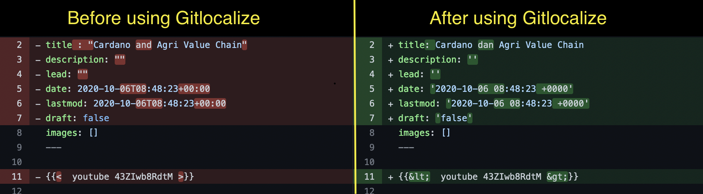

Each markdown you created will have the yaml front matter (on top of each markdown file):

```yaml
---
title: "<title>"
description: "<description>"
lead: "<lead>"
date: 2020-11-23T11:55:16+01:00
draft: false
images: []
---
Content of file
```

### Problems

While using Gitlocalize to translate content to other languages, the yaml front matter could be changed like this:

```yaml
---
title: <title>
description: <description>
lead: <lead>
date: "2020-11-23T11:55:16+01:00"
draft: "false"
images: []
---
```

You cannot see these yaml front matter until you create a pull request on Github.<br/>
Open `Files changed` on Github after pushing commits will show what being changed so you can spot the different.

Example:


From the picture above, the changes are:

- The double quotation marks wrap around `title`,`description`,`lead` has been removed
- The double quotation marks now being added to `date`,`lastmod` and `draft`
- The angle brackets `< >` are being changed to `&lt; &gt;`

But yaml is strictly and would lead to **build fail**.

### Actions required

Therefore, make sure check your front matter **match the original file**:

- **Add** double quotation marks to `title`,`description`,`lead`
- **Remove** double quotation marks on `date`,`lastmod` and `draft`
- **Change** `&lt; &gt;` to angle brackets `< >`

```yaml
---
title: "<title>"
description: "<description>"
lead: "<lead>"
date: 2020-11-23T11:55:16+01:00
draft: false
images: []
---
```
