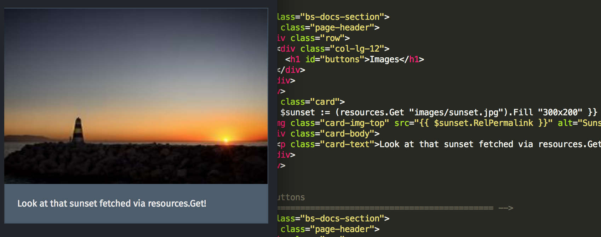

A great meetup where we started off talking about the upcoming Ideafest, Cardano Summit and Hackathons. A lot of familiar faces joined into an insightful discussion about Scams and Scam detection. Lead by Peter Bui. We also discussed trading bots, Social and Environmental applications and touched on Stable Coins.

