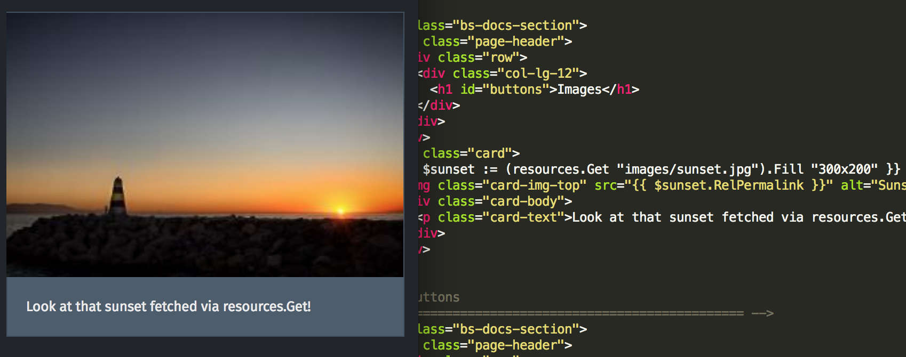

Một buổi gặp mặt tuyệt vời, nơi chúng tôi bắt đầu nói về Ideafest, Cardano Summit và Hackathons sắp tới. Rất nhiều gương mặt quen thuộc đã tham gia vào một cuộc thảo luận sâu sắc về Lừa đảo và phát hiện Lừa đảo. Dẫn đầu bởi Peter Bùi. Chúng tôi cũng thảo luận về robot giao dịch, các ứng dụng Xã hội và Môi trường và đề cập đến Đồng ổn định.

